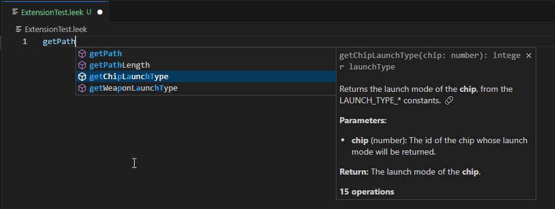
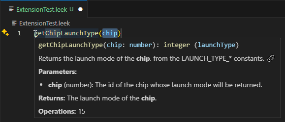

# LeekScript Language Support

A Visual Studio Code extension that provides language support for LeekScript.

(All .leek files should be handled by the extension)

Autocomplete:

Function definition:

Easy deployment:

- in vscode settings, configure leekwars token secret
- add F1 commands
  - Leekwars: pull => pull remote AI files from leekwars API
  - Leekwars: push => syncs remote AI files with local code

Remote compilation ?:

Todo:

- Run a custom version leek-wars-generator with the flag --start_code_server
  It will start a local web server to which the extension will send your .leek code files on all edit events, and tell you where the errors / warnings are in your code

## How to use this project

This project builds itself from the official leekwars project, you need to follow a few steps in order to do that

### Debug

- Run `npm install` to install dependencies
- Init the leek-wars offcial front end submodule to fetch the repo
- Run `node builder/builder.js`
- F5 / Ctrl+F5 to automatically recompile & debug the extension

### From VSIX

1. Package the extension: `vsce package`
2. Install the `.vsix` file in VSCode

## Features

- **Leekscript Syntax**: All keywords from the official leekscript language
- **Syntax Highlighting**: Full syntax highlighting for LeekScript files (`.leek`, `.ls`)
- **Auto-completion**: IntelliSense support with keyword and built-in function suggestions
- **Bracket Matching**: Automatic bracket, parenthesis, and quote pairing
- **Functions definition**: Function definition preview

## Discord

Join the **Leek Wars Tools** [Discord](https://discord.gg/Py6EaDhQE5)

## Contributing

Contributions are welcome! Please feel free to submit pull requests or open issues.
