# LeekScript Advanced Language Support

A Visual Studio Code extension that provides language support for LeekScript, making developement easier and accessible outside of the web code editor

The extension can handle "complex" codebases, with multiple files, classes (static, private, public members etc), handle class inheritence and much more

[Basic Features](#Basic-Features)

[Advanced Features](#Advanced-Features)

[How it works](#How-it-works)

[Get started](#Get-started)

## Basic Features

#### Native Leekscript autocompletion (constants, functions, types etc)

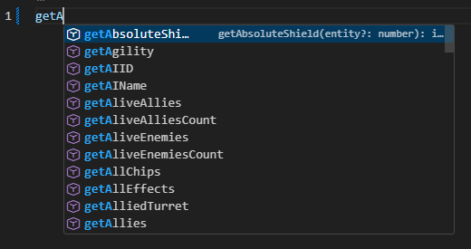

#### Native Leekscript hover details

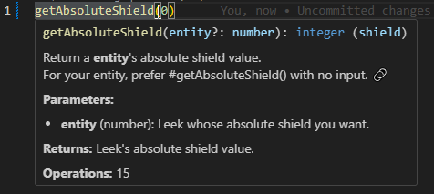

## Advanced Features

#### Real time error detection

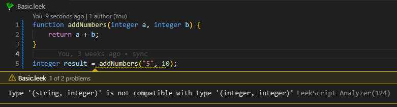

#### User code definitions

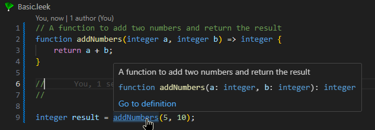

#### Go to definition feature

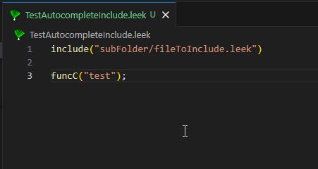

#### Advanced code features

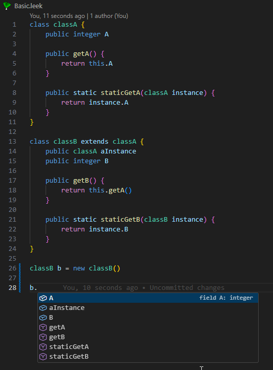

#### How it works

The extension communicates in real time with a java http api that uses the original leekwars code to parse the code and extract user defined variables, classes, functions etc during compilation.

This information is then used in the extension to add basic features, such as "Go to definition", autocomplete, and more.

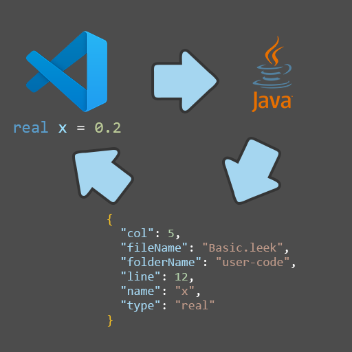

### Get started

As shown on the diagram above, this extension needs to communicate with an API that will analyze & parse the leekscript code.

#### <u>Step 1</u>

You must first clone and setup the [java project](https://github.com/Bux42/leek-wars-generator), the follow the [http server](https://github.com/Bux42/leek-wars-generator#Http-server) instructions to get the server ready and running

You can check that the server is running by going to http://localhost:8080/ in your browser

A message "LeekScript Code Analysis Server is running" should be visible (the url port might change if you put a custom port)

#### <u>Step 2</u>

Setup your leekscript code repository

Create or clone a new repository inside the generator (mentionned above) "user-code" folder.

```
cd leek-wars-generator
git clone https://github.com/Bux42/leekwars-ai.git user-code
```

#### <u>Step 3</u>

Open the repository folder in a new vscode window

#### <u>Step 4</u>

Create a ".vscode" folder at the root of your repository, then create a "settings.json" file inside that folder.

Get your leekwars API token, you can find it directly from the browser using the developper tools, in the "cookies" section

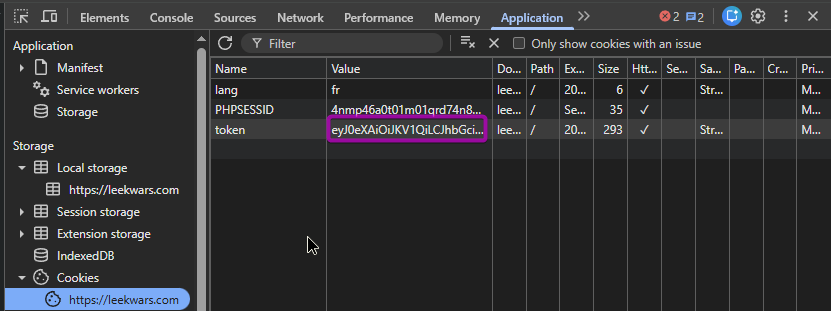

Put the token in the corresponding field in settings.json

```json
{
  "leekscript.leekwarsApiToken": "YOUR_API_TOKEN",
  "leekscript.javaApiUrl": "http://localhost:8080"
}
```

#### <u>Step 5</u>

Pull your code from leekwars, using the "Pull all ais" command
Press F1 and search for "Leekscript: Leekwars: Pull All AIs"

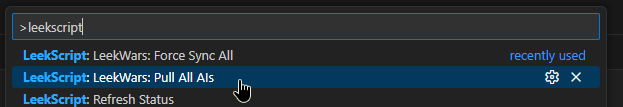

The extension will create an exact copy of your leekwars files & folders locally, using the API token setup in [Step 4](#Step-4)

It is recommended to not browse the leekwars website when pulling all files to avoid to get rate limited (it fires 10 requests / seconds), especially if you have a large codebase.

This command should only be used once when you first setup the project, or when you changed your code on the web editor (not recommended) and want to pull the changes.

**Warning:** This command will overwrite whatever files you have locally with what you have on leekwars

#### <u>Step 6</u>

Add a ".leek" extension to all your leekscript files

This is recommended so that the extension recognizes your code as leekscript, and enables all features.

You can check if a file is recognized by the extension if the icon appears next to it

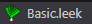

#### <u>Step 7</u>

Check that the extension is up and running smoothly by looking at the status bar at the bottom of vscode

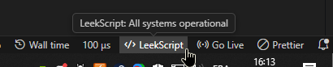

The extension should be fully setup, and you should be able to work on your leekscript code by now!

### Pushing your local code to LeekWars

To push your code to leekwars, use the "Sync" command, by hitting F1 then searching for "Leekscript: Leekwars: Force Sync All"

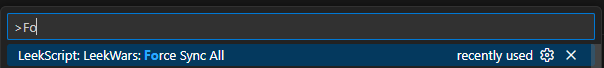

This command will create, delete, update the "remote" files and folders on LeekWars to match what you have locally

The first sync will take some time, as it will fetch the code of every code file on LeekWars (it's the only way to check for code differences currently), every subsequent sync will only check for files that were modified during the session using a local cache, and should be much quicker.

**Warning: The web editor has a cache, you might think your sync did not work, but it did, to verify it, do a hard refresh on your browser**

## Developpment tutorial

This project builds itself from the official leekwars project, you need to follow a few steps in order to do that

### Debug

- Run `npm install` to install dependencies
- Init the leek-wars offcial front end submodule to fetch the repo
- Run `node builder/builder.js`
- F5 / Ctrl+F5 to automatically recompile & debug the extension

### From VSIX

1. Package the extension: `vsce package`
2. Install the `.vsix` file in VSCode

## Discord

Join the **Leek Wars Tools** [Discord](https://discord.gg/Py6EaDhQE5)

## Contributing

Contributions are welcome! Please feel free to submit pull requests or open issues.
